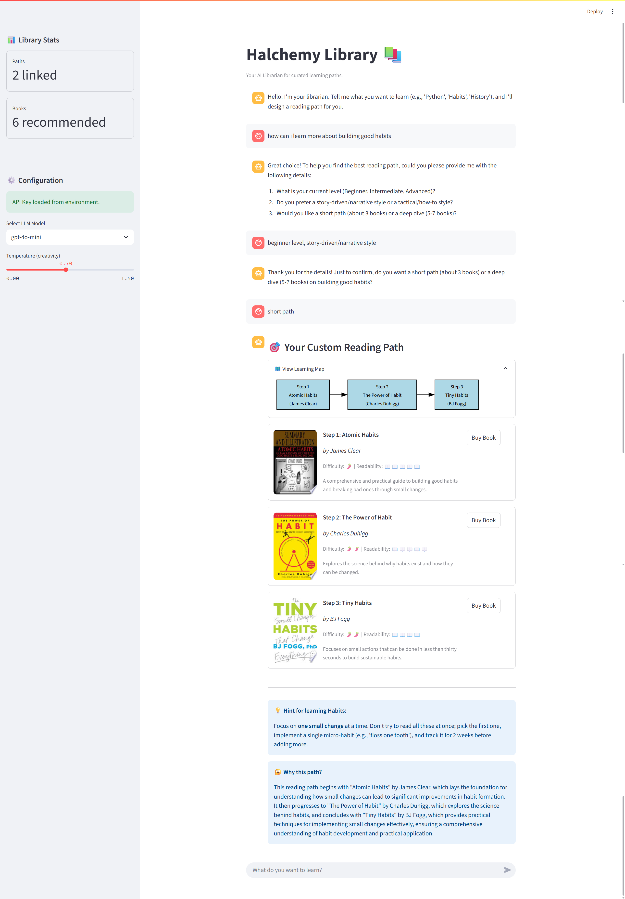

# Halchemy Library 📚

**Halchemy Library** is an AI-assisted reading path recommender designed for *learning*, not just reading. Unlike standard book search tools, it focuses on building a structured "curriculum" of 3–7 books to take you from beginner to competent in a specific domain.

It combines a **curated dataset** (to prevent AI hallucinations) with a **deterministic sequencing engine** and **OpenAI-powered chat** to provide personalized, logical learning journeys.



## ✨ Key Features

- **AI Librarian (Chat-to-Query):** Interactive chat interface that translates your learning goals into structured queries.
- **Visual Roadmaps:** Automatic generation of learning maps using Graphviz to visualize your progression.
- **Deterministic Sequencing:** Logic-based ordering of books (e.g., Procedural skills by difficulty, History chronologically).
- **Expert Rationales:** AI-generated explanations of *why* each book was chosen for your specific path.
- **Path Editing:** Reorder, remove, or replace books after a path is generated.
- **Multiple Exports:** Download your curated curriculum as a clean Markdown file or a professional PDF.
- **Library Stats:** Track your learning ROI with metrics on generated paths and recommended books.
- **Purchase Links:** Integrated links for direct purchasing when available.

## 🚀 Getting Started

### Prerequisites
- Python 3.11+
- [Graphviz](https://graphviz.org/download/) (required for visual roadmaps)

### Installation

1. **Clone the repository:**
   ```bash
   git clone https://github.com/halchemylab/halchemy-learning-atlas.git
   cd halchemy-learning-atlas
   ```

2. **Set up Environment Variables:**
   Copy the example environment file and add your OpenAI API key:
   ```bash
   cp .env.example .env
   # Edit .env and add your OPENAI_API_KEY
   ```

3. **Create a virtual environment:**
   ```bash
   # Windows
   python -m venv .venv
   .\.venv\Scripts\activate

   # Mac/Linux
   python3 -m venv .venv
   source .venv/bin/activate
   ```

4. **Install dependencies:**
   ```bash
   pip install -r requirements.txt
   ```

### Running the App

Start the Streamlit application:
```bash
streamlit run app.py
```

The app will open in your default web browser at `http://localhost:8501`.

## 🧠 How It Works

The system uses a **Hybrid Architecture**:

1.  **Conversation:** An LLM processes your intent and extracts parameters (Topic, Level, Style, Depth).
2.  **Filtering:** The engine queries `data/books.csv` to find matches from a curated source.
3.  **Sequencing:** A Python-based sorter orders the books based on the learning type (Procedural, History, or Behavioral).
4.  **Rationale & Hints:** The LLM analyzes the selected books to provide a custom rationale and domain-specific advice.

## 🧪 Testing

The project includes a comprehensive test suite covering data validation and recommendation logic.

Run tests using:
```bash
python -m unittest discover tests
```

CI runs the same command on Python 3.11, 3.12, and 3.13 using the pinned dependencies in `requirements-dev.txt`.

## 📂 Project Structure

```
.
├── app.py                 # Main Streamlit application
├── data/
│   ├── books.csv          # Curated book metadata (Source of Truth)
│   └── roi_stats.json     # Runtime metrics file, generated locally
├── src/
│   ├── books.py           # Filtering and sequencing logic
│   ├── exports.py         # Markdown and PDF export helpers
│   ├── llm_client.py      # OpenAI integration
│   ├── path_editor.py     # Path editing helpers
│   ├── pdf_gen.py         # PDF report generation logic
│   ├── recommendations.py # Recommendation orchestration
│   ├── roi.py             # Stats tracking and ROI logic
│   └── utils.py           # Utility functions (e.g., cover fetching)
├── tests/                 # Unit and integration tests
└── docs/
    └── book_data.md       # Guidelines for managing book metadata
```

## 🤝 Contributing

To add more books to the library, edit `data/books.csv`. Please read [docs/book_data.md](docs/book_data.md) for strict guidelines on metadata quality and verification to prevent "hallucinations."
